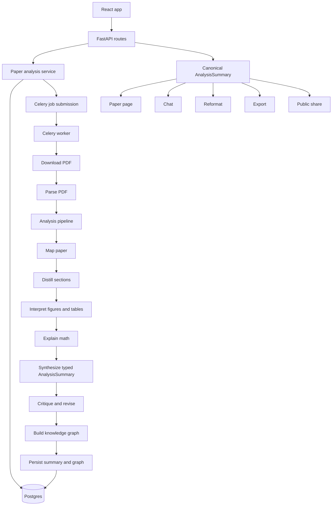

# PaperRelay

PaperRelay is a research paper distillation app for turning arXiv papers into a structured, plain-English walkthrough that a non-expert can follow without losing the core method, evidence, math, and caveats.

## What It Does

PaperRelay is no longer just a short summary flow. The current product is built around:

- passwordless sign-in with magic links
- background paper analysis with progress tracking
- a multi-pass distillation pipeline instead of a single short summary prompt
- a canonical typed backend summary contract shared across persistence, API responses, export, chat, reformat, and public share flows
- section-aware walkthroughs that cover problem, prior work, core idea, method, evaluation, evidence, verdict, and takeaways
- interpreted evidence from extracted figures and tables
- formula explanations with nearby context when equation extraction succeeds
- a grounded knowledge graph built from paper concepts, interpreted evidence, and LLM-generated relationship triples
- exports to PDF and Markdown with PaperRelay branding and source-paper links
- public share links for completed analyses
- an embedded source-paper viewer in the paper page
- completion notifications when a background analysis finishes

## Product Flow

1. Sign in with a magic link.
2. Submit an arXiv abstract or PDF URL.
3. Track the job while the backend downloads, parses, distills, and synthesizes the paper.
4. Read the finished analysis in the paper workspace.
5. Open the original paper alongside the distillation when you need to verify details.
6. Export or share the completed result.

## Distillation Model

PaperRelay uses a staged backend pipeline rather than sending the whole paper through one summary prompt.

High-level flow:

1. Parse the paper PDF into text, sections, formulas, figures, and tables.
2. Build a paper map to identify the main question, likely contribution, and important sections.
3. Distill sections with coverage-aware selection so the output includes method, evaluation, results, and limitations.
4. Interpret tables and figures as evidence objects instead of treating them as raw snapshots only.
5. Explain math using extracted equations or method-context fallback; each formula includes an intuition, prerequisite list, and location hint.
6. Generate LLM relationship triples between key terms for the knowledge graph.
7. Synthesize the final user-facing distillation — including `prior_work_and_gap`, `core_intuition`, `authors_claims`, `evidence_assessment`, and `bottom_line_verdict` alongside the existing fields.
8. Run a critic pass to flag overclaims, missing caveats, vague method descriptions, and evidence gaps; conditionally revise flagged fields.
9. Build the knowledge graph with LLM-generated edges as high-confidence connections.

This keeps token usage under control while preserving more of the paper than a single short-context pass.

## Architecture Status

The current implementation is intentionally split into clear layers instead of letting routes or workers own the whole application flow.

Backend layers:

- schema layer: owns the canonical `AnalysisSummary` contract, nested summary models, and shared response schemas
- route layer: owns HTTP input/output concerns for papers, export, share, and auth
- analysis service layer: owns paper-analysis lifecycle orchestration such as lookup, queue submission, and completed-analysis access rules
- pipeline layer: owns AI-stage orchestration across paper mapping, section distillation, results interpretation, math explanation, critique, and revision
- worker layer: owns Celery job execution, progress persistence, knowledge-graph build, and final save/failure behavior

Summary-contract status:

- persisted summaries, API responses, export rendering, chat context, reformat behavior, and public share responses now all use the same canonical summary model
- legacy stored rows are still accepted through normalization at the storage boundary
- synthesis-time fields now use canonical names earlier in the pipeline
- the processor-to-pipeline-to-worker handoff now uses a typed summary object instead of loose dicts

Frontend structure:

- `PaperPage` is now primarily a composition layer
- data loading and polling live in `usePaperAnalysis`
- completion notifications live in `useAnalysisCompletionNotice`
- reading-level mutation flow lives in `usePaperReadingLevel`
- right-panel viewer/chat state lives in `usePaperRightPanel`
- heavy routes and workspace panels are lazy-loaded so chat, graph, and secondary pages do not all ship in the initial frontend path

This is a materially simpler architecture than the original implementation, where contract mapping, workflow rules, and long-running orchestration were spread across routes, workers, export code, and frontend page components.

Compact diagram:

```text
React app
  -> FastAPI routes
     -> paper analysis service
        -> Postgres lookup/create
        -> Celery job submission
     -> canonical AnalysisSummary responses
        -> paper page
        -> chat
        -> reformat
        -> export
        -> public share

Celery worker
  -> download PDF
  -> parse PDF
  -> analysis pipeline
     -> map paper
     -> distill sections
     -> interpret figures/tables
     -> explain math
     -> synthesize typed AnalysisSummary
     -> critique/revise
  -> build knowledge graph
  -> persist summary + graph to Postgres
```

Mermaid diagram:



See [architecture.md](architecture.md) for the running architecture review and step-by-step refactor history.

## Frontend Experience

The frontend is centered on a single authenticated shell:

- `Analyze` for starting a new paper analysis
- `Library` for all completed and in-progress papers
- a merged account menu with sign-out

The paper page now includes:

- `Anatomy`, `Math`, and `Knowledge Graph` tabs
- a first-class anatomy flow for problem, prior work, core idea, method, evaluation, evidence, verdict, and takeaways
- a sticky jump-to-section navigation strip inside long anatomy views
- reading-level switching between `general`, `technical`, and `eli5`
- explicit evaluation setup and bottom-line verdict sections
- strongest evidence callouts and interpreted evidence cards
- interpreted evidence cards with confidence labels
- extracted figure/table context
- a toggleable original-paper PDF viewer
- a built-in chat panel for follow-up questions on completed analyses
- a more informative workspace header with paper title, authors, arXiv ID, and responsive controls
- in-app and browser completion notifications for background jobs

The paper workspace has also been decomposed into focused hooks so page-level state is split across:

- analysis loading and polling
- completion-notification handling
- reading-level mutation flow
- right-panel state for chat and source-paper viewing

The login and auth flow also auto-validates the persisted session on refresh, so stale client state is cleared when the backend session is no longer valid.

## Exports

Completed analyses can be exported as:

- PDF
- Markdown

Exports now include:

- PaperRelay branding
- paper title, authors, arXiv ID
- original paper URL and source PDF URL
- the richer distillation sections
- explicit bottom-line verdict rendering
- interpreted evidence from figures and tables
- formula explanations
- knowledge graph summaries

Export rendering now uses the same typed canonical summary model as the rest of the backend, which keeps export behavior aligned with authenticated paper views, chat, reformat, and public share responses.

## Share Links

Completed analyses can be shared publicly with a generated link.

Shared links now return the same canonical summary shape used by the authenticated paper API, so shared-paper views and logged-in paper views stay aligned on:

- anatomy fields such as `prior_work_and_gap`, `core_intuition`, `authors_claims`, `evidence_assessment`, and `bottom_line_verdict`
- interpreted evidence
- typed knowledge-graph payloads

## Current Limits

PaperRelay is still text-first.

Known limitations:

- figure understanding is only as good as extracted captions and surrounding text
- PDF extraction quality varies by paper layout
- heavily image-driven results can still be underexplained
- the critic/revision pass adds latency to the pipeline — profile on real papers before deciding if it should be made opt-in
- chat history is stateless (not persisted to DB); conversations are lost on page reload
- parser-heavy tests should be run in the Compose/runtime environment where the full dependency set is available

## Auth Model

The intended auth flow is:

- `POST /api/auth/request-link` accepts an email and sends a magic link
- the email points back to the frontend login page with a verification token
- the frontend calls `POST /api/auth/verify`
- the returned session token is used for authenticated API requests
- `GET /api/auth/me` validates the current session during frontend startup

## LLM Provider Configuration

The backend can run against either:

- `openai`
- `azure` for Azure OpenAI / Azure AI Foundry OpenAI-compatible endpoints

### OpenAI

```bash
LLM_PROVIDER=openai
OPENAI_API_KEY=sk-your-openai-api-key-here
OPENAI_MODEL=gpt-4o-mini
```

### Azure OpenAI / Azure AI Foundry

```bash
LLM_PROVIDER=azure
AZURE_OPENAI_API_KEY=your-azure-api-key
AZURE_OPENAI_BASE_URL=https://your-resource.openai.azure.com/openai/v1/
AZURE_OPENAI_MODEL=your-deployment-name
```

Notes:

- Azure uses the deployment name as the `model` value.
- Docker Compose passes both OpenAI and Azure env vars through; the backend selects one using `LLM_PROVIDER`.

## Email Delivery

The default Compose stack uses Mailpit:

```bash
SMTP_HOST=mailpit
SMTP_PORT=1025
FROM_EMAIL=noreply@paperrelay.local
```

Mailpit UI is available at `http://localhost:8025`.

If `SMTP_HOST` is unset, the backend falls back to logging the magic link instead of sending a real email.

## Docker Compose

The local stack is designed to run via Docker Compose:

- `frontend`: React app served by nginx
- `backend`: FastAPI API
- `worker`: Celery worker
- `db`: PostgreSQL
- `redis`: Redis broker/result backend
- `mailpit`: local SMTP server and inbox UI

### Build All Services

```bash
docker compose build
```

### Build Selected Services

```bash
docker compose build backend worker frontend
```

### Start the Full Stack

```bash
docker compose up --build
```

### Start Detached

```bash
docker compose up --build -d
```

### Stop the Stack

```bash
docker compose down
```

### Stop and Remove Volumes

```bash
docker compose down -v
```

## Service Endpoints

- Frontend: `http://localhost:3000`
- Backend API: `http://localhost:8000`
- Backend docs: `http://localhost:8000/docs`
- Mailpit inbox: `http://localhost:8025`

The backend `GET /health` and `GET /` responses include a non-secret `llm` section showing the active provider and model selection.

## Backend Dependency Management

The backend uses `uv` with [`backend/pyproject.toml`](backend/pyproject.toml).

### Local Backend Setup With uv

```bash
cd backend
uv sync --group dev --no-install-project
```

### Run Backend Locally With uv

```bash
cd backend
uv run alembic upgrade head
uv run uvicorn app.main:app --reload --host 0.0.0.0 --port 8000
```

### Run the Worker Locally With uv

```bash
cd backend
uv run celery -A app.workers.celery_app worker --loglevel=info
```

## Testing

The intended runtime is Docker Compose. Run tests inside containers when you want the closest match to the app environment.

### Backend Tests

```bash
docker compose run --rm backend uv run pytest
```

### Targeted Backend API Tests

```bash
docker compose run --rm backend uv run pytest tests/api/test_auth.py tests/api/test_papers.py tests/api/test_export.py tests/api/test_share.py -q
```

### Targeted Backend Service Tests

```bash
docker compose run --rm backend uv run pytest tests/services/test_ai_processor.py tests/services/test_export_service.py tests/services/test_knowledge_graph.py tests/workers/test_tasks.py -q
```

### Frontend Tests

```bash
docker compose --profile tools run --rm frontend_tools sh -lc "npm install --legacy-peer-deps --no-audit --no-fund && npm test -- --run"
```

### Frontend Type Check / Build

```bash
docker compose --profile tools run --rm frontend_tools sh -lc "npm install --legacy-peer-deps --no-audit --no-fund && npm run build"
```

## Useful Commands

### Follow Logs

```bash
docker compose logs -f
```

### Follow One Service

```bash
docker compose logs -f backend
docker compose logs -f worker
docker compose logs -f frontend
```

### Restart One Service

```bash
docker compose restart backend
```

### Open a Shell in the Backend Container

```bash
docker compose run --rm backend sh
```

### Open a Shell in the Frontend Builder Container

```bash
docker compose --profile tools run --rm frontend_tools sh
```

## Notes

- Set `OPENAI_API_KEY` in `.env` before running the full analysis flow, or configure the Azure variables instead.
- Full end-to-end validation is best done through Compose because the host Python environment may not include all backend dependencies like `reportlab` or `pdfplumber`.
- The `frontend_tools` build can still hit a Rollup optional native dependency issue on some environments.

## Documentation

- [API documentation](docs/API.md)
- [Architecture review and refactor log](architecture.md)
- [Project TODO / epic tracking](TODO.md)
